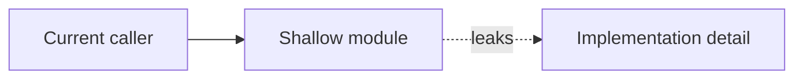
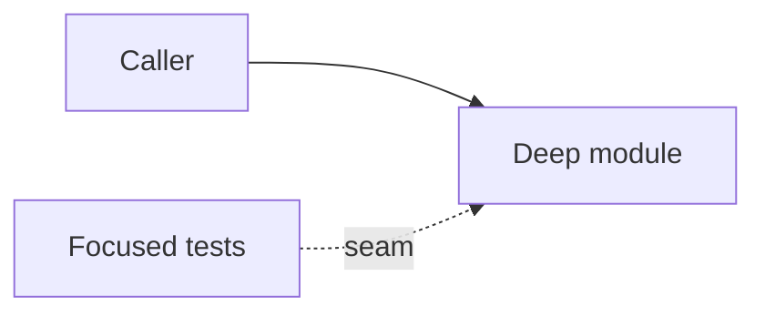

# Tech Debt Ticket Template

Copy this template into `docs/techdebt/YYYY-MM-DD-<candidate-slug>.md` for each
architecture review candidate. Keep one candidate per file so handoff,
discussion, and implementation can move independently.

````markdown
# <Candidate Title>

**Status:** proposed
**Review date:** YYYY-MM-DD
**Source report:** `<absolute temp HTML path>#<candidate-anchor>`
**Recommendation:** Strong | Worth exploring | Speculative
**Area:** backend | agent | RAG | evals | frontend | docs
**Milestone/doc anchor:** `docs/milestones/...` or `docs/...`

## Problem

One or two sentences naming the architectural friction. Use the skill
vocabulary: `module`, `interface`, `implementation`, `deep`, `shallow`, `seam`,
`adapter`, `locality`, and `leverage`.

## Current Shape

- `<file.py>`: current responsibility or leakage
- `<file.py>`: current responsibility or leakage
- `<test_file.py>`: current test coupling or missing coverage

## Proposed Shape

Describe the deeper module or deletion/consolidation. Name the intended
interface, what implementation moves behind it, and which adapters or tests
should sit at the seam.

## Before



## After



## Expected Wins

- locality:
- leverage:
- tests:
- interface:

## Risks And Trade-offs

- 

## Acceptance Criteria

- [ ] The new or changed interface is documented in code by focused tests.
- [ ] Existing behavior remains covered by the relevant milestone tests.
- [ ] The old shallow path is removed or left with a clear reason.
- [ ] `uv run pytest <focused slice>` passes.
- [ ] `uv run ruff check .` passes for Python changes.

## Grilling Notes

Record settled answers from `grill-with-docs` here. Link an ADR only when the
decision is hard to reverse or surprising.
````
