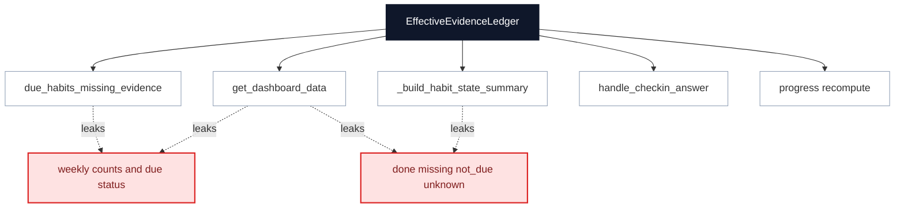
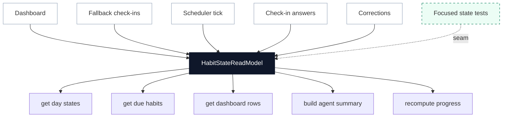

# Deepen Effective Habit State Read Model

**Status:** proposed
**Review date:** 2026-06-24
**Source report:** `/private/var/folders/ww/s0hkrfgs7mzcfw5wl8_g1v2m0000gn/T/kaizen-architecture-review-20260624-172219.html#effective-habit-state`
**Recommendation:** Strong
**Area:** backend, agent
**Milestone/doc anchor:** `docs/milestones/09-correction-loop.md`, `docs/milestones/11-check-in-response-loop.md`, `docs/milestones/12-habit-plan-onboarding.md`

## Problem

Effective habit state is deeper than it was when the review was written, but the
read side is still shallow. Callers still rebuild status, weekly counts, due
state, correction flags, and agent summaries around the ledger instead of using
one small interface.

## Current Shape

- `app/habits/evidence.py`: owns `EffectiveHabitState`,
  `EffectiveEvidenceLedger`, `get_effective_habit_state`, and
  `recompute_progress_from_effective_state`.
- `app/habits/plan.py`: rebuilds weekly positive counts and due-habit decisions
  inside `due_habits_missing_evidence`.
- `app/dashboard.py`: rebuilds dashboard status, week counts, correction
  annotations, and plan-progress joins.
- `app/agent/runner.py`: rebuilds a text habit-state summary for the proactive
  graph.
- `app/checkins/service.py`: already uses the effective-state interface for
  before/after state and XP recomputation.
- `tests/habits/test_habit_plan.py`, `tests/test_dashboard.py`, and
  `tests/agent/test_proactive.py`: cover the behavior through several caller
  shapes rather than one read-model seam.

## Proposed Shape

Deepen `app/habits/evidence.py` or a sibling `app/habits/state.py` module into
the habit-state read model. Keep the public interface small: queries such as
`get_habit_day_states`, `get_due_habits`, `get_dashboard_habit_rows`, and
`build_agent_habit_summary` should return typed data while the implementation
owns ledger loading, weekly counts, status precedence, expected windows, and
correction/check-in semantics.

The goal is not to invent a broad abstraction. The goal is to make the current
effective-state implementation absorb the repeated read logic that already
serves dashboard, fallback check-ins, XP, and proactive nudges.

## Before

## After

## Expected Wins

- locality: state rules live once
- leverage: one interface, many callers
- tests: caller tests shrink to integration
- interface: status semantics stop leaking
- implementation: weekly counts move inward

## Risks And Trade-offs

- A too-large read model could become a catch-all habit module. Keep the
  interface query-shaped and avoid moving command/edit behavior into it.
- Dashboard-specific presentation fields should remain in `app/dashboard.py`
  unless the field is shared by another caller.
- Renaming habits remains a separate milestone 12 decision because evidence and
  progress rows reference habit names today.

## Acceptance Criteria

- [ ] One state read-model interface computes daily status, weekly counts,
      due-habit state, correction/check-in flags, and agent summary inputs.
- [ ] `app/habits/plan.py`, `app/dashboard.py`, and `app/agent/runner.py` stop
      duplicating weekly positive-count and status-selection logic.
- [ ] `handle_checkin_answer` and correction handling still recompute XP from
      the same effective state path.
- [ ] Tests cover log evidence, correction overrides, yes/partial/no check-in
      answers, daily cadence, specific weekdays, and N-times-per-week cadence at
      the read-model seam.
- [ ] Existing caller tests remain as smoke/integration coverage:
      `tests/habits/test_habit_plan.py`, `tests/test_dashboard.py`,
      `tests/agent/test_proactive.py`, and `tests/test_webhook.py`.
- [ ] `uv run pytest tests/habits tests/test_dashboard.py tests/agent/test_proactive.py tests/test_webhook.py` passes.
- [ ] `uv run ruff check .` passes for Python changes.

## Grilling Notes

Recommended first question: should this be a deeper `app/habits/evidence.py`
interface or a new `app/habits/state.py` read-model module?

Recommended answer: create `app/habits/state.py` only if it keeps
`evidence.py` focused on ledger construction; otherwise deepen
`evidence.py` directly and avoid a shallow split.
