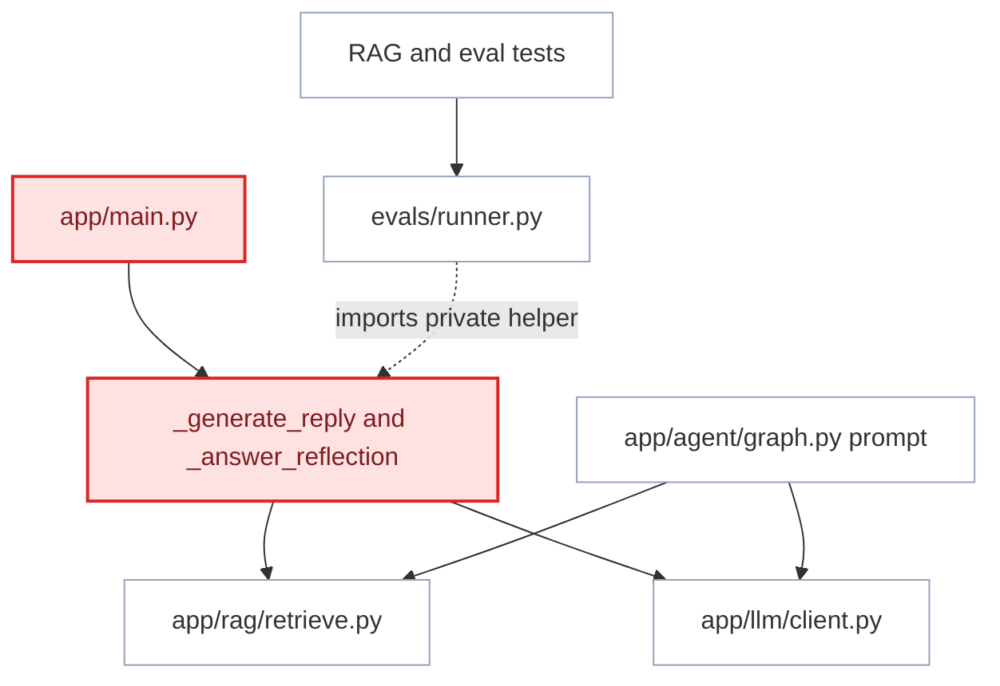
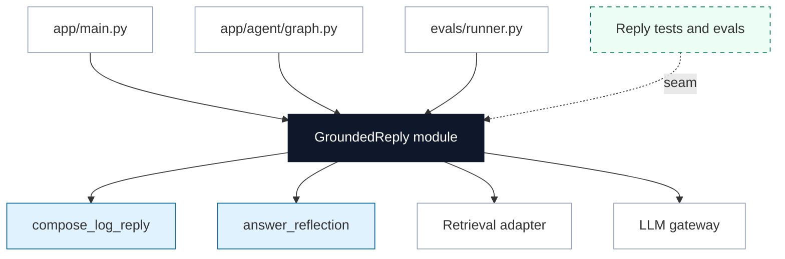

# Deepen Grounded Replies

**Status:** implemented
**Review date:** 2026-06-24
**Source report:** `/private/var/folders/ww/s0hkrfgs7mzcfw5wl8_g1v2m0000gn/T/kaizen-architecture-review-20260624-172219.html#grounded-replies`
**Recommendation:** Worth exploring
**Area:** RAG, evals
**Milestone/doc anchor:** `docs/milestones/10-lesson-grounded-reflection.md`, `docs/milestones/07-evals-observability.md`

## Problem

Grounded reply behavior is shallow because prompt rules and reflection logic
live in route-private helpers. RAG tests and evals should exercise a meaningful
grounded-reply interface, but the current eval runner imports `_generate_reply`
from `app/main.py`, which makes the webhook module part of the reply-generation
interface.

## Original Shape

- `app/main.py`: owns reflection classification, coaching reflection lesson
  retrieval, reflection prompt construction, `_generate_reply`, and ordinary
  webhook reply branching.
- `app/agent/graph.py`: owns another grounded reply prompt for user-message
  responses inside the LangGraph path.
- `app/agent/tools.py`: exposes retrieval tools used by both graph and main.
- `evals/runner.py`: imports `app.main._generate_reply` to score reply quality.
- `tests/rag/test_rag.py` and `tests/evals/`: validate retrieval and judging,
  but the grounded reply interface itself is route-private.

## Proposed Shape

Create a grounded-reply module, for example `app/rag/replies.py` or
`app/coaching/replies.py`, with typed interfaces for `compose_log_reply` and
`answer_reflection`. The implementation should own prompt rules, retrieved
lesson formatting, history caps, abstain behavior when lessons do not fit, and
technique naming requirements. `app/main.py`, `app/agent/graph.py`, and
`evals/runner.py` should call that module rather than sharing private route
helpers or duplicated prompts.

The seam should stay narrow: retrieval remains in `app/rag/retrieve.py` and the
LLM gateway remains `app/llm/client.py`.

## Implemented Shape

- `app/rag/replies.py` owns the typed reply interfaces, prompt rules, bounded
  lesson/history formatting, reflection-mode classification, and no-lesson
  abstain behavior.
- `app/telegram/intake.py` routes reflection questions to `answer_reflection`
  and no longer owns grounded-reply prompts.
- `app/agent/graph.py` calls `compose_log_reply` for ordinary user-message
  responses instead of carrying a duplicate prompt.
- `evals/runner.py` scores replies through `compose_log_reply`, so evals use
  the same interface as runtime log replies.

## Before

## After

## Expected Wins

- locality: prompt rules live together
- leverage: evals use real interface
- tests: stop importing route helpers
- implementation: grounding owns abstain rules
- interface: reflection modes are typed

## Risks And Trade-offs

- Do not hide retrieval quality issues inside reply generation. Retrieval tests
  should remain separate from reply-composition tests.
- Avoid a generic coaching module if only grounded replies move. The interface
  should reflect actual Kaizen reply modes.
- Prompt changes can affect eval numbers. Capture before/after metrics when the
  implementation changes behavior.

## Acceptance Criteria

- [x] A grounded-reply module exposes typed interfaces for ordinary log replies
      and reflection answers.
- [x] `app/main.py`, `app/agent/graph.py`, and `evals/runner.py` no longer
      import or duplicate route-private grounded reply helpers.
- [x] Reply generation still uses `app/llm/client.py`; no vendor SDK imports
      are introduced outside the gateway.
- [x] Grounded replies still name a relevant technique when a retrieved lesson
      fits and avoid forcing a technique when no retrieved lesson fits.
- [x] Focused tests cover log reply composition, action-oriented reflection,
      descriptive reflection, no-history behavior, and no-fitting-lesson
      abstain behavior.
- [x] `uv run pytest tests/rag tests/evals` passes.
- [ ] If behavior changes, `uv run python -m evals.runner` records measured
      before/after grounded-response results.
- [x] `uv run ruff check .` passes for Python changes.

## Grilling Notes

Recommended first question: should the module live under `app/rag/` or a new
`app/coaching/` package?

Recommended answer: start under `app/rag/replies.py` if the first implementation
only composes retrieved lessons into grounded replies. Move to `app/coaching/`
only when non-RAG coaching behavior becomes a real second adapter.
