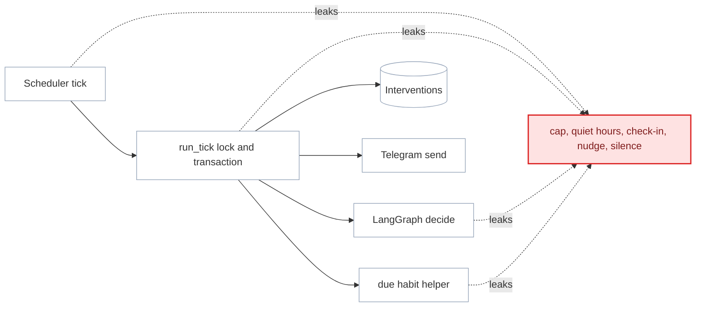
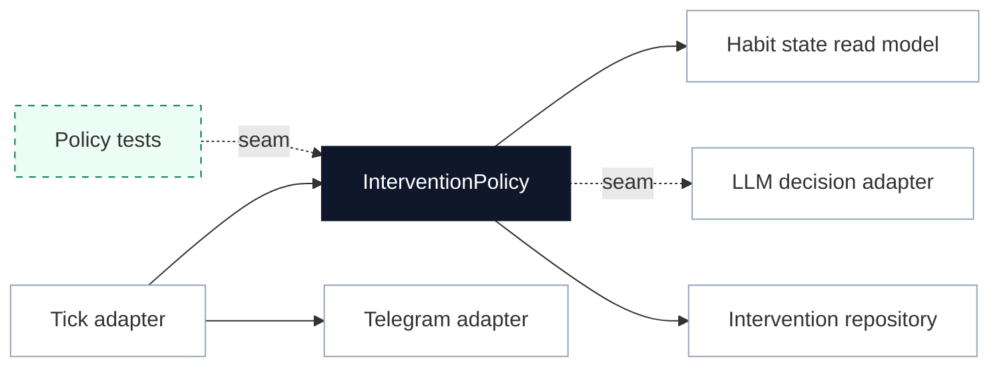

# Deepen Intervention Policy

**Status:** proposed
**Review date:** 2026-06-24
**Source report:** `/private/var/folders/ww/s0hkrfgs7mzcfw5wl8_g1v2m0000gn/T/kaizen-architecture-review-20260624-172219.html#intervention-policy`
**Recommendation:** Worth exploring
**Area:** agent
**Milestone/doc anchor:** `docs/milestones/06-proactive-agent.md`, `docs/milestones/10-lesson-grounded-reflection.md`, `docs/milestones/11-check-in-response-loop.md`

## Problem

Intervention policy is spread across scheduler tick choreography, fallback
check-in helpers, the LangGraph decision prompt, daily cap enforcement, and
intervention persistence. The current implementation works, but the policy
interface is shallow: tests and future changes must understand several modules
to answer whether Kaizen should send a check-in, send a nudge, or stay silent.

## Current Shape

- `app/agent/runner.py`: owns advisory locking, daily cap checks, fallback
  check-in branching, LangGraph invocation, intervention row creation, and
  Telegram send timing.
- `app/habits/plan.py`: owns due-habit calculation and fallback check-in
  message construction.
- `app/agent/graph.py`: owns proactive lesson retrieval and LLM decision rules
  for responding or staying silent.
- `app/db/models.py`: stores `Intervention` rows for `check-in`, `proactive`,
  and `silence` outcomes.
- `tests/agent/test_proactive.py`: exercises policy outcomes through
  `run_tick`, which couples policy tests to graph and persistence choreography.

## Proposed Shape

Introduce an `InterventionPolicy` module that accepts typed current state and
returns a typed decision: `send_check_in`, `send_nudge`, or `stay_silent`, plus
recordable rationale, message, technique, and any required persistence details.
Keep `run_tick` as the scheduler adapter that owns advisory locks,
transactions, and sending. Keep the LangGraph call as a decision adapter used by
the policy only when deterministic checks do not already choose check-in or
silence.

The policy should make daily cap, fallback check-in eligibility, quiet hours,
LLM decision fallback, and recording semantics explicit data rather than
implicit route through the runner.

## Before

## After

## Expected Wins

- locality: policy decisions live once
- leverage: evals can target policy
- tests: no graph required for deterministic branches
- adapter: LLM decision is replaceable
- interface: rationale becomes typed

## Risks And Trade-offs

- Splitting policy too early can create shallow indirection. Do this when the
  next proactive or quiet-hours change makes the runner harder to reason about.
- The LLM still needs real judgment for nudges. The policy module should not
  reduce proactive intervention to deterministic reminders.
- Sending must remain outside the DB transaction; the runner currently preserves
  that safety.

## Acceptance Criteria

- [ ] A typed intervention decision model represents `send_check_in`,
      `send_nudge`, and `stay_silent` outcomes with rationale and recordable
      fields.
- [ ] Daily cap, same-day fallback check-in prevention, and graph-error silence
      are tested without invoking the LangGraph decision node.
- [ ] The LLM decision adapter is still used for grounded proactive nudge
      judgment when deterministic checks do not decide.
- [ ] `run_tick` keeps advisory locking, transaction boundaries, persistence,
      and Telegram sends as adapter choreography around the policy.
- [ ] `Intervention` rows remain auditable for check-ins, nudges, and silence.
- [ ] `uv run pytest tests/agent/test_proactive.py tests/agent/test_scheduler.py` passes.
- [ ] `uv run ruff check .` passes for Python changes.

## Grilling Notes

Recommended first question: is this refactor justified before quiet-hours and
engagement policy become richer?

Recommended answer: keep it as "Worth exploring" until one more proactive
policy feature lands. If quiet hours, engagement scoring, or nudge cooldowns are
next, implement this first; otherwise leave the runner intact.
