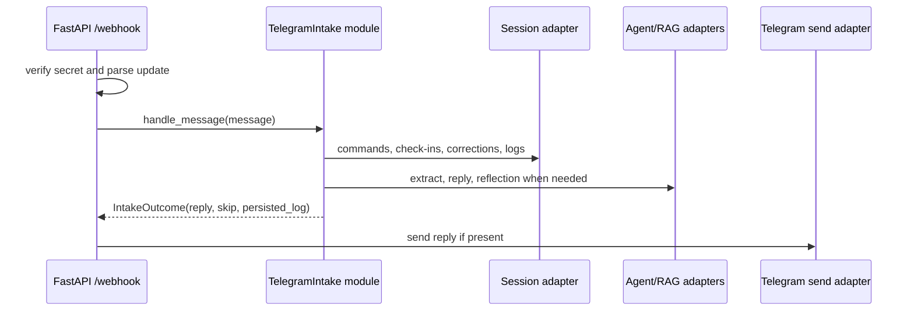

# Deepen Telegram Intake

**Status:** proposed
**Review date:** 2026-06-24
**Source report:** `/private/var/folders/ww/s0hkrfgs7mzcfw5wl8_g1v2m0000gn/T/kaizen-architecture-review-20260624-172219.html#webhook-intake`
**Recommendation:** Strong
**Area:** backend
**Milestone/doc anchor:** `docs/milestones/12-habit-plan-onboarding.md`

## Problem

Telegram intake is shallow: `app/main.py` exposes too much implementation behind
one FastAPI route. Adding `/habits`, `/habit_add`, `/habit_edit`, unsupported
commands, pending wizard state, corrections, check-ins, log persistence,
extraction, memory writes, XP, and replies will make the route the de facto
module unless the intake interface is deepened first.

## Current Shape

- `app/main.py`: verifies webhook secret, parses updates, enforces the
  single-user guard, handles dashboard commands, routes check-in answers and
  corrections, persists logs, runs extraction, recomputes progress, writes
  memory, and generates replies.
- `app/checkins/service.py`: owns fallback check-in answer handling but is
  called directly from the route.
- `app/corrections/service.py`: owns correction handling but is called directly
  from the route.
- `app/habits/plan.py`: owns habit-plan context and seed plans, but milestone 12
  command routing is not yet isolated.
- `tests/test_webhook.py`: exercises many intake behaviors through the FastAPI
  endpoint because there is no smaller intake seam.

## Proposed Shape

Create a Telegram intake module, for example `app/telegram/intake.py`, with a
small interface such as `handle_update(update, send_message)` or
`handle_message(message) -> IntakeAction`. The route should stay responsible for
HTTP concerns: header verification, Pydantic update validation, dependency
injection, and sending replies through the Telegram adapter. The intake
implementation should own command routing, pending habit-plan flows, check-in
answer routing, correction routing, ordinary log persistence, extraction,
progress recompute, memory write, and reply generation order.

The interface should return typed actions or outcomes so tests can exercise
intake behavior without patching a FastAPI route for every branch.

## Before

```mermaid
flowchart TD
  Route[/webhook route]:::wide
  Secret[secret check]
  Guard[single-user guard]
  Commands[/start /dashboard /app]
  Checkins[check-in answers]
  Corrections[corrections]
  Logs[log persistence]
  Extract[extract facts]
  Progress[recompute XP]
  Memory[store memory]
  Reply[agent or reflection reply]
  HabitCommands[milestone 12 habit commands]:::future

  Route --> Secret
  Route --> Guard
  Route --> Commands
  Route --> Checkins
  Route --> Corrections
  Route --> Logs
  Route --> Extract
  Route --> Progress
  Route --> Memory
  Route --> Reply
  HabitCommands -. will widen .-> Route

  classDef wide fill:#fee2e2,stroke:#dc2626,stroke-width:2px,color:#7f1d1d;
  classDef future fill:#fef3c7,stroke:#d97706,stroke-width:2px,color:#78350f;
```

## After



## Expected Wins

- locality: routing order lives together
- leverage: habit commands add cleanly
- tests: intake tests avoid HTTP setup
- interface: route surface stays small
- adapter: Telegram sending is replaceable

## Risks And Trade-offs

- Do not move FastAPI request/header behavior into the intake module; that would
  blur the HTTP adapter seam.
- Do not make a generic message bus. The module can be Telegram-specific because
  Telegram chat is the v1 write surface.
- Multi-message habit-plan wizard storage may require an Alembic migration; keep
  schema design tied to milestone 12 acceptance criteria.

## Acceptance Criteria

- [ ] `/webhook` delegates allowed user messages to one Telegram intake
      interface after secret verification and update parsing.
- [ ] The intake module routes dashboard commands, habit-plan commands,
      check-in answers, corrections, unsupported commands, and ordinary logs in
      a documented order.
- [ ] `/habits`, `/habit_add`, and `/habit_edit` command handling can be tested
      through intake-level tests without persisting ordinary `logs` rows.
- [ ] Existing `/start`, `/dashboard`, and `/app` behavior remains unchanged,
      including bot suffix handling.
- [ ] Tests cover route smoke behavior separately from intake routing detail.
- [ ] `uv run pytest tests/test_webhook.py` passes.
- [ ] `uv run ruff check .` passes for Python changes.

## Grilling Notes

Recommended first question: should the intake interface return typed actions or
perform Telegram sends itself?

Recommended answer: return typed outcomes and keep sending as the route-level
adapter. That keeps the seam useful for tests and avoids hiding HTTP/Telegram
side effects inside command logic.
